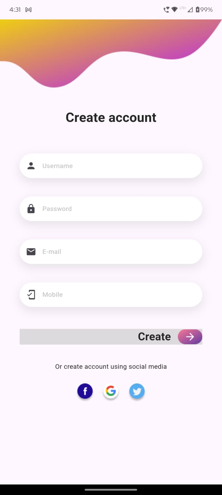
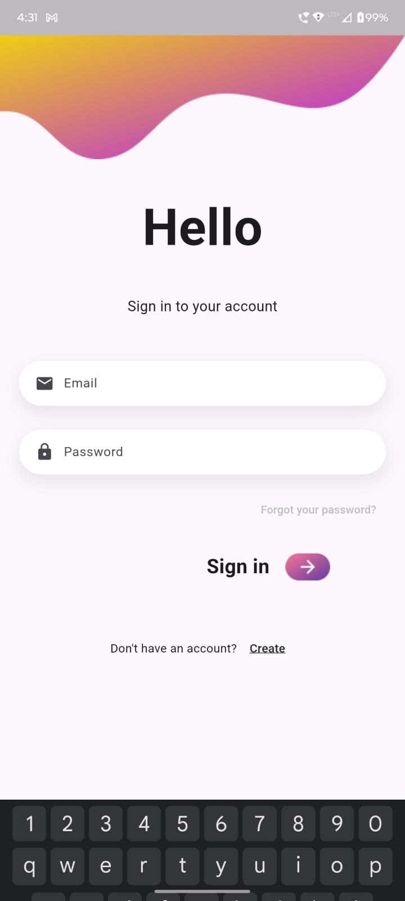
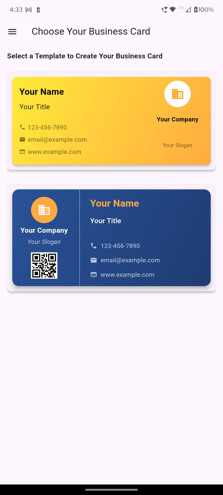
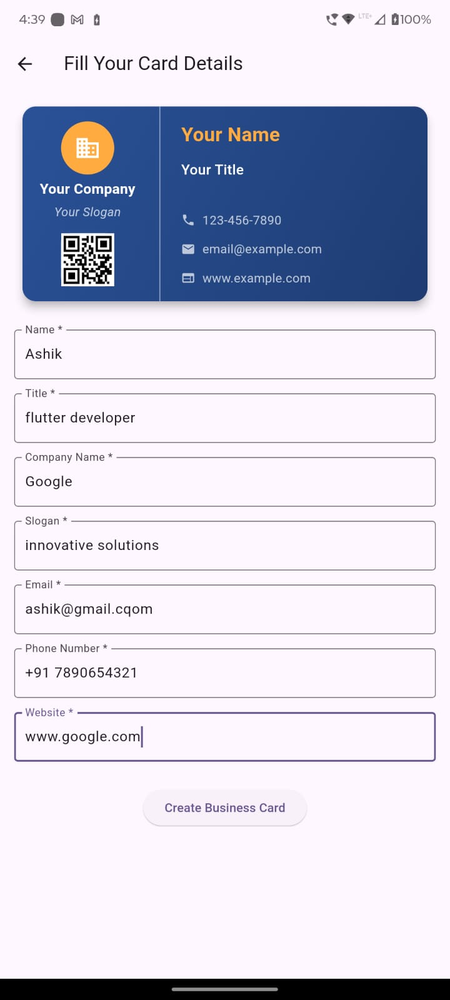
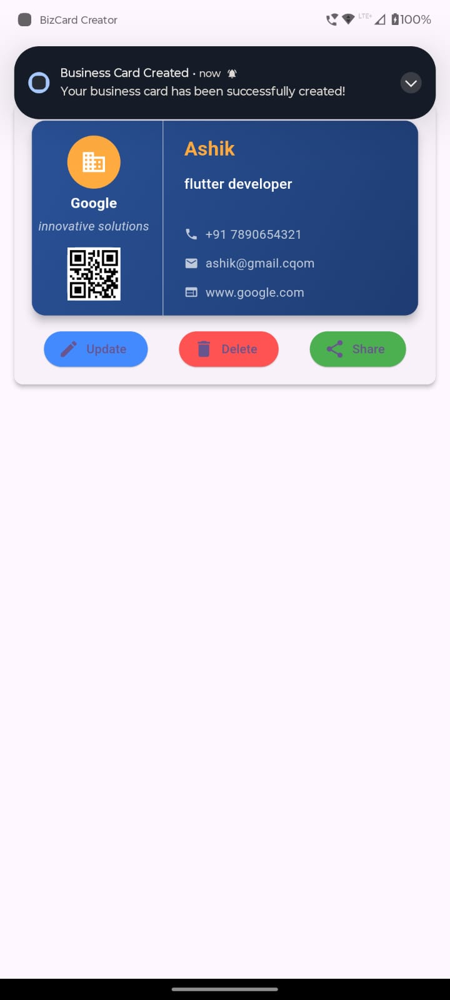

<!DOCTYPE html>
<html lang="en">
<head>
    <meta charset="UTF-8">
    <meta name="viewport" content="width=device-width, initial-scale=1.0">
 
</head>
<body>
    <h1 align="center">📇 Bizcard Creator</h1>

   

        <b>Bizcard Creator</b> is an innovative app to create professional business cards quickly and easily. The app supports user authentication through Google Sign-In and Email/Password and provides two stunning templates for business cards. It also features push notifications powered by Firebase and OneSignal.
    

   <h2>🌟 Features</h2>
    <ul>
        <li>Login with Google or Email/Password</li>
        <li>Create personalized business cards</li>
        <li>Two elegant card templates to choose from</li>
        <li>Push notifications powered by Firebase and OneSignal</li>
    </ul>

   <h2>🖼️ Screenshots</h2>
   

        
         
        <em>Signup Screen</em>
    

        
         
        <em>Login Screen</em>
    

    

        
         
        <em>Template Selection Screen</em>
    

      

        
         
        <em>Form page </em>
    

    

        
         
        <em>Push Notification Example and card created </em>
    

  <h2>🚀 Getting Started</h2>

   <h3>Prerequisites</h3>
    <ul>
        <li>Flutter installed on your machine (<a href="https://flutter.dev/docs/get-started/install" target="_blank">Install Flutter</a>)</li>
        <li>Firebase project set up with your app (<a href="https://firebase.google.com/docs/flutter/setup" target="_blank">Set up Firebase</a>)</li>
        <li>Google services configuration file (<code>google-services.json</code>) added to <code>android/app</code></li>
    </ul>

  <h3>Installation</h3>
    <ol>
        <li>Clone this repository:
            <pre><code>git clone https://github.com/yourusername/bizcard-creator.git</code></pre>
        </li>
        <li>Navigate to the project directory:
            <pre><code>cd bizcard-creator</code></pre>
        </li>
        <li>Get the dependencies:
            <pre><code>flutter pub get</code></pre>
        </li>
        <li>Run the app:
            <pre><code>flutter run</code></pre>
        </li>
    </ol>

   <h2>📱 Features Overview</h2>

  <h3>1. Login</h3>
    
Users can log in using their Google account or by signing up with email and password.

   <h3>2. Business Card Templates</h3>
    
The app provides two professional templates for creating business cards. Users can customize the templates with their details.

   <h3>3. Push Notifications</h3>
    
Stay updated with notifications powered by Firebase and OneSignal.

  <h2>⚙️ Technology Stack</h2>
    <ul>
        <li><b>Frontend:</b> Flutter</li>
        <li><b>Backend:</b> Firebase Authentication, Firestore</li>
        <li><b>Notifications:</b> Firebase Cloud Messaging, OneSignal</li>
    </ul>

  <h2>📄 License</h2>
    
This project is licensed under the MIT License - see the <code>LICENSE</code> file for details.

   <h2>🙌 Contributing</h2>
  
Contributions are welcome! Please open an issue or create a pull request to contribute to this project.

   <h2>💬 Support</h2>
   
If you encounter any issues, please open an issue in this repository, or reach out to <a href="mailto:support@bizcardcreator.com">support@bizcardcreator.com</a>.

   <h2>🎉 Acknowledgments</h2>
    <ul>
        <li><a href="https://flutter.dev/" target="_blank">Flutter</a> for the amazing framework</li>
        <li><a href="https://firebase.google.com/" target="_blank">Firebase</a> for the backend services</li>
        <li><a href="https://onesignal.com/" target="_blank">OneSignal</a> for push notifications</li>
    </ul>
</body>
</html>
